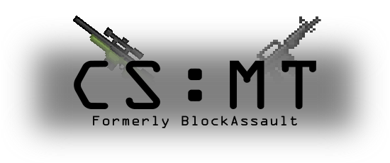

BlockAssault is a subgame of Minetest, made for playing PvP or PvE. For training PvP, Aim. Made from scratch

This game has [bots](https://github.com/EISHU-MT/bs_bots) feature!

If you find a bug, glitch or crash. Please send to us! You would help us too much **:)**
# Features

- Weapons for battle **(Almost all)**

- Swords support

- Currency for trading weapons

- Trading table for all teams

- **SkinsDB & Other skins support**

- Score/Stats for players

- 2+ teams **(Blue/Red/Yellow/Green)**

- Modular system **(Game can be overrided completely from other mods *need to be bs_tweaks*)**

- Uses MTG

- Various animations for players

- Shaders support

- Maps support

- Achievements

## Starting the game

With **GUI**:
These options must be set using the **GUI**:

 - Enable damage: if making a _local_ server for map making, unmark this option
 - Creative mode: If you wanna use map maker this is needed to be marked, else unmarked if not
 - Host server: When making a _local / global_ this need to be marked, else not
 - Port: When making a _local or global_ server this is needed, must be a number, after done, save the port number.
 - If **Host Server** is marked, players can join there, lan or global. using your specified IP address and the saved port number.

# License

All mods' respective licenses can be found at [`LICENSE.txt`](LICENSE.txt).

# Mods

All mods stands in [⇒ mods](mods/)

## Join us!

 On **Discord**: [Link Is Here!](https://discord.gg/EWRYqfKXP8)
 
 On **MineTest**: Address: **ehs.minetest.land:54700**
